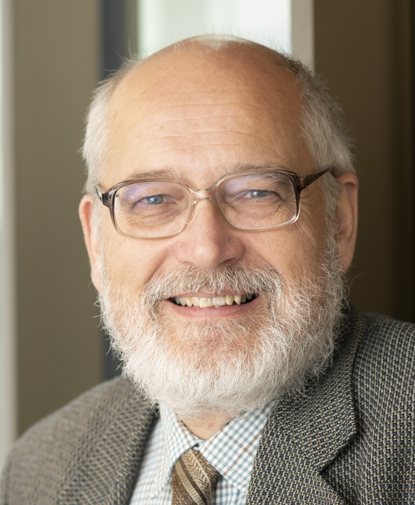
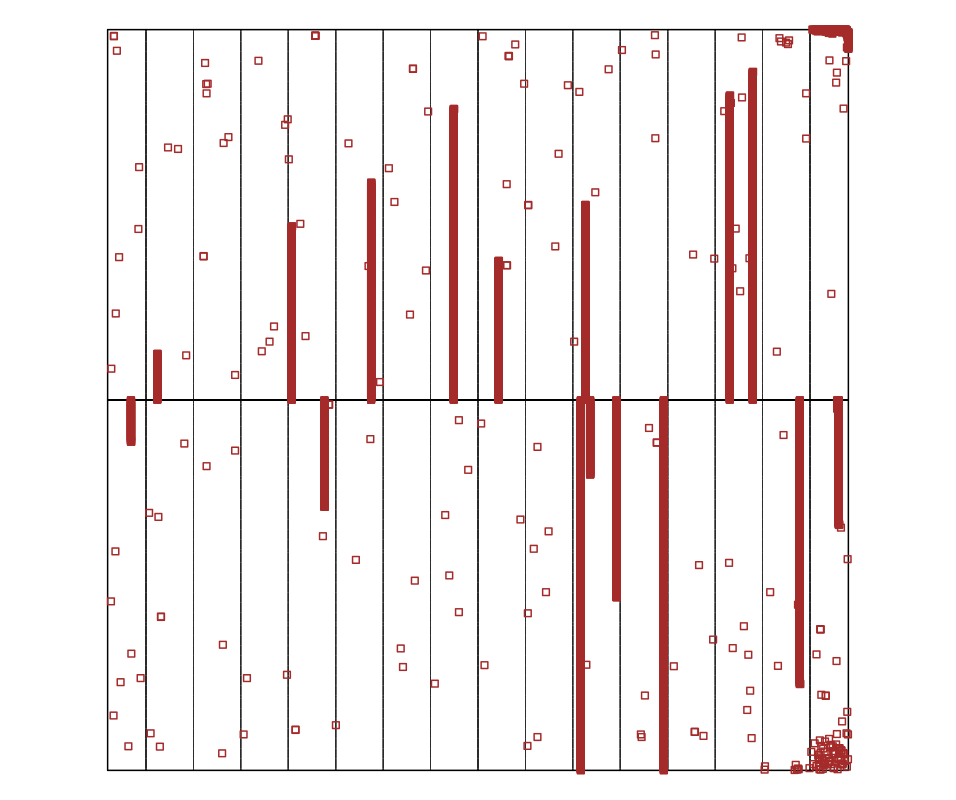

# Wilfrid Kendall's Personal Page

:::: {.columns layout="[70,30]" .t}

::: {.column}

I am an emeritus professor in the [Statistics department](https://www.warwick.ac.uk/statsdept) at the [University of Warwick](https://www.warwick.ac.uk).  My research interests lie mostly in probability theory:  random processes, stochastic geometry, stochastic calculus, computer algebra in statistics and probability, and perfect simulation. 

:::

::: {.column}

{width=2in}

:::

::::

My occasional blog [Random Curiosities](https://blogs.warwick.ac.uk/randomcuriosities/) records some thoughts arising when teaching or researching.

## Recent and partial biography

I served as President of the [Bernoulli Society](https://www.bernoullisociety.org/) (2013-2015), and also served on the Council of the [International Statistical Institute](https://isi-web.org/) (2015-2019). I was one of two founding co-directors of [APTS](https://www.apts.ac.uk/) (serving from October 2007 to September 2016), first with [David Firth](http://www2.warwick.ac.uk/fac/sci/statistics/staff/academic-research/firth/), then with [Adam Johansen](https://warwick.ac.uk/fac/sci/statistics/staff/academic-research/johansen/). A few years ago I found myself back on the APTS Executive Committee for a brief period: _deja vu_ all over again.

Here is a **[memento](https://www.bernoullisociety.org/files/BernoulliNews2019-2.pdf#page=20)** of a very happy occasion at the end of 2019, kindly organized by [Stephen Connor](https://www.york.ac.uk/maths/staff/stephen-connor/) 
and [Elke Thonnes](https://warwick.ac.uk/fac/sci/statistics/staff/academic-research/thonnes/personal).

## Recent talks
Visit [my talks page](wilfridskendall.github.io/talks/), which links to handouts (PDF) of slides for recent talks.

## Recent research projects

[EPSRC](https://www.ukri.org/about-us/epsrc/) has funded the following 3-year research projects of mine since the mid-2010's:

 * [Probabilistic coupling and nilpotent diffusions](https://blogs.warwick.ac.uk/nilpotent/);
 * [Inside-out: Statistical methods for Computed Tomography validation](https://blogs.warwick.ac.uk/insideout/);
 * [Dirichlet forms and Markov chain Monte Carlo](https://gow.epsrc.ukri.org/NGBOViewGrant.aspx?GrantRef=EP/R022100/1).

Additionally, with [Giacomo Zanella](https://sites.google.com/site/gzanellawebpage/home) (at that time my research student), I worked on a project to apply statistical methods to contribute to debates in Anglo-Saxon history:

 * [Anglo-Saxon Placenames and Point Processes](https://blogs.warwick.ac.uk/settlements/).

## Recent publications

Four different ways in which information about my publications is accumulated on the web:

 * [ORCID](https://orcid.org/0000-0001-9799-3480]orcid.org/0000-0001-9799-3480);
 * [Google Scholar](https://scholar.google.co.uk/citations?user=0IJZ3EkAAAAJ) (includes Google citation statistics);
 * [`arXiv`](https://arxiv.org/a/kendall_w_1]arxiv.org/a/kendall_w_1) (most new research outputs go straight to `arXiv`, at or before submission to a journal);
 * [ResearchGate](https://www.researchgate.net/profile/Wilfrid_Kendall/publications/).

Here is a [list (no longer maintained) of my older Warwick preprints](https://www.warwick.ac.uk/WSK/ppt), with [abstracts](https://www.warwick.ac.uk/WSK/abstracts),

 * linked by topic,
 * including (some) illustrative pictures.

## Github software repositories
These repositories hold software related to miscellaneous computing projects:

:::: {.columns layout="[70,30]" .t}

::: {.column}

 * **Detector Checker** funded by [The Alan Turing Institute](https://www.turing.ac.uk/))  
(two repositories [DetectorChecker code](https://github.com/alan-turing-institute/DetectorChecker) and
[DetectorChecker WebApp](https://github.com/alan-turing-institute/DetectorCheckerWebApp)) This project concerns [`R`](https://www.R-project.org/) software developed in collaboration with my colleague [Julia Brettschneider](https://warwick.ac.uk/fac/sci/statistics/staff/academic-research/brettschneider/), and [Turing Institute](https://www.turing.ac.uk/) research software engineers [Tomas Lazauskas](https://github.com/tomaslaz) and [Oscar Giles](https://github.com/OscartGiles). The project developed [`R` software](https://github.com/alan-turing-institute/DetectorChecker) and a [Web App](https://github.com/alan-turing-institute/DetectorCheckerWebApp) to aid in the assessment of damage to CT scanners arising from exposure to high energy radiation. While the target application concerns CT scanners, this package can also be used to analyze screen damage arising from other sources.  
Initially the Web App was available online, but host funding expired. The 
[Web App](https://github.com/alan-turing-institute/DetectorCheckerWebApp) repository includes instructions for running the Web App in a docker image.  
The Detector Checker project is no longer being developed, though the repositories remain accessible.

:::

::: {.column}

{width=15%}

:::

:::: 

 * [**LaTeX-writing:**](https://github.com/WilfridSKendall/LaTeX-writing)  
This project has developed [LaTeX](https://www.latex-project.org/) packages to assist in writing mathematics (namely, `WSKmaths.cls`) and annotating it with revision notes _et cetera_ (namely `WSKtracking.cls`). The packages are still under occasional development, and I use them all the time!

---

`w dot s dot kendall at warwick dot ac dot uk`

This web-page was last updated 2024-05-23.

